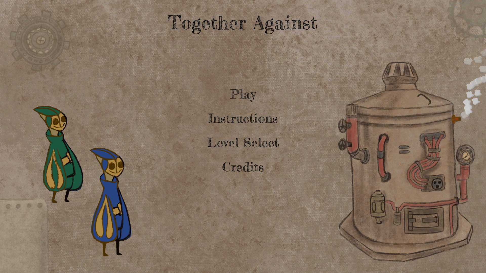
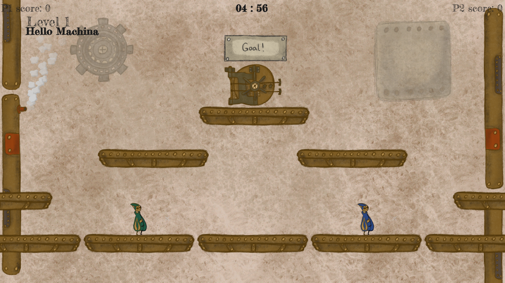

# Together-Against
A Unity game which was developed in the [2nd HüttenJam](https://xn--httenjam-65a.at/) (13.04.2023 - 16.04.2023).

**Thema:** Extreme Conditions

####Instructions:

###### Player 1:
+ **A** and **D** - Movement
+ **W** - Jump
+ **E** - Pickup
+ **F** - Throw away

###### Player 2:
+ **Arrow Left** and **Arrow Right** - Movement
+ **Arrow Up** - Jump
+ **Period / "."** - Pickup
+ **Comma / ","** - Throw away

### [View on itch.io](https://kyunru.itch.io/together-against)

 
 

